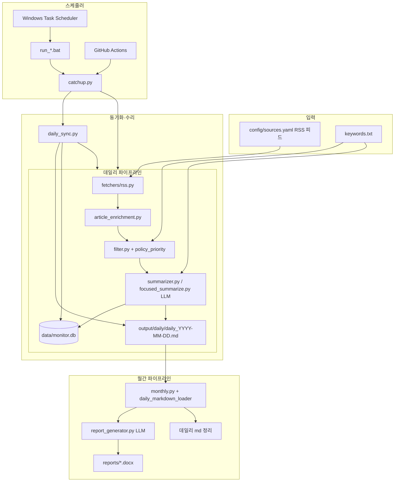

# Tech Market Intelligence Monitor

프라운호퍼 한국 사무소용 **국내 R&D·기술협력 타겟팅 모니터링 자동화 시스템**입니다.  
국내 RSS·정부 아카이브(korea.kr, PACST)에서 기사·보도자료를 수집하고(정부 URL은 본문·PDF 보강), **해외 기사 제외** + 키워드·**정부·R&D 타깃** 규칙으로 필터링한 뒤 LLM으로 **투자 주체·위탁 연구 니즈** 중심 요약하여 **데일리 R&D 인텔리전스 로그**와 **월간 Markdown 보고서**(`monthly_YYYY-MM.md`)를 생성합니다.

> **일반 사용자:** 로컬 PC 설치·스케줄 등록은 [`사용설명서.md`](사용설명서.md), **GitHub 웹만**으로 리포트 확인은 [`사용설명서-깃허브.md`](사용설명서-깃허브.md)를 참고하세요.

> **이 README만으로 프로젝트를 재구축할 수 있도록** 아키텍처, 파일 구조, 비즈니스 규칙, LLM 프롬프트 규칙, 스케줄링 규칙을 모두 기록합니다.  
> 맨 아래 **「재구축 프롬프트」** 섹션을 AI에 그대로 붙여넣으면 코드베이스를 처음부터 다시 만들 수 있습니다.

---

## 목차

1. [한 줄 요약](#한-줄-요약)
2. [시스템 아키텍처](#시스템-아키텍처)
3. [빠른 시작](#빠른-시작)
4. [환경 변수](#환경-변수)
5. [설정 파일](#설정-파일)
6. [CLI 명령어](#cli-명령어)
7. [데일리 파이프라인 규칙](#데일리-파이프라인-규칙)
8. [일관성 수리·재처리 (daily-repair)](#일관성-수리재처리-daily-repair)
9. [데일리 리서치 로그 양식](#데일리-리서치-로그-양식)
10. [LLM 요약 규칙 (Summarizer)](#llm-요약-규칙-summarizer)
11. [월간 Word 보고서 규칙](#월간-word-보고서-규칙)
12. [신뢰 출처 정책](#신뢰-출처-정책)
13. [스케줄링 (로컬·클라우드)](#스케줄링-로컬클라우드)
14. [출력 경로](#출력-경로)
15. [프로젝트 구조](#프로젝트-구조)
16. [유틸리티 스크립트](#유틸리티-스크립트)
17. [이메일 발송 (준비 중)](#이메일-발송-준비-중)
18. [재구축 프롬프트](#재구축-프롬프트)

---

## 한 줄 요약

```
매일:  국내 RSS 수집 → 본문·PDF 보강(정부 URL) → Korea-scope 필터 → R&D·투자 신호 우선 LLM 요약(적합도 1–5)
       → SQLite 저장 → daily_YYYY-MM-DD.md (R&D 기회 스캔 표) → Git push
매월:  daily_*.md → R&D 적합 4점 이상만 추출 → rd-intelligence-report-YYYY-MM-ko.docx
```

---

## 시스템 아키텍처



### 데이터 저장 이중 구조

| 저장소 | 용도 |
|--------|------|
| `output/daily/daily_*.md` | 사람이 읽는 **데일리 리서치 로그**. **월간 보고서 생성의 1차 입력** (`daily_markdown_loader.py`가 파싱) |
| `data/monitor.db` (SQLite) | URL **중복 제거**, 구조화된 요약 필드 보관, md 재생성·수리용 백업 |
| `data/daily_scheduler_state.json` | 마지막으로 완료한 리포트 날짜 (`last_completed_log_date`) |
| `reports/*.docx` | 월간 Word 보고서 (로컬·GitHub Actions 공통, `REPORTS_OUTPUT_DIR=reports/` 권장) |

---

## 빠른 시작

```powershell
# 로컬 작업 폴더 (OneDrive 동기화 경로 — Windows Task Scheduler 기본값)
cd "C:\Users\Admin\OneDrive - Fraunhofer\Documents\python-project"

python -m venv .venv
.\.venv\Scripts\Activate.ps1
pip install -r requirements.txt
copy .env.example .env
# .env 에 API 키·REPORTS_OUTPUT_DIR 입력
```

### 의존성 (`requirements.txt`)

```
feedparser>=6.0.11
httpx>=0.27.0
openai>=1.40.0
python-docx>=1.1.2
python-dotenv>=1.0.1
apscheduler>=3.10.4
pyyaml>=6.0.2
click>=8.1.7
pypdf>=5.0.0
```

Python **3.11** 권장 (GitHub Actions 기준).

---

## 환경 변수

`.env.example` 참고:

| 변수 | 기본값 | 설명 |
|------|--------|------|
| `OPENAI_API_KEY` | (필수) | LLM API 키 (OpenAI, Groq, Gemini 등 OpenAI 호환) |
| `OPENAI_BASE_URL` | 없음 | Groq: `https://api.groq.com/openai/v1`, Gemini: `https://generativelanguage.googleapis.com/v1beta/openai/` |
| `MODEL_NAME` | `gemini-2.0-flash` | 요약·월간 합성 모델 |
| `DEEPL_API_KEY` | (선택) | **예약 변수, 향후 사용 예정.** `src/config.py`의 `Settings.deepl_api_key`에 로드되지만, 현재 요약·데일리·월간 파이프라인 어디에서도 참조하지 않음 |
| `DATABASE_PATH` | `data/monitor.db` | SQLite 경로 |
| `REPORTS_OUTPUT_DIR` | `output/monthly` (코드 기본) / **`reports/` (로컬·GHA 권장)** | 월간 .docx 출력 폴더 |
| `LOG_LEVEL` | `INFO` | 로깅 레벨 |
| `MAX_ARTICLES_PER_RUN` | `30` | 1회 실행당 LLM 요약 상한 (Groq 무료 티어 ~100k tokens/day 대응) |
| `SUMMARIZER_REQUEST_DELAY` | `1.0` | LLM 요청 간 대기(초), RPM 제한 대응 |
| `DAILY_LOG_RECORDER` | `Tech Market Monitor (auto)` | 데일리 md 상단 `기록자:` 필드 |
| `EMAIL_ENABLED` | `false` | `true`면 리포트 이메일 발송 (모듈 준비됨, 파이프라인 연동 예정) |
| `EMAIL_PROVIDER` | `sendgrid` | `sendgrid` 또는 `smtp` |
| `SENDGRID_API_KEY` | (선택) | SendGrid API 키 |
| `EMAIL_FROM` / `EMAIL_FROM_NAME` | (선택) | 발신 주소·표시 이름 |
| `EMAIL_DAILY_SUBJECT` | `[TMR] Daily {date}` | 데일리 메일 제목 템플릿 |
| `EMAIL_MONTHLY_SUBJECT` | `[TMR] Monthly {year}-{month:02d}` | 월간 메일 제목 템플릿 |

---

## 설정 파일

### `keywords.txt` — 키워드 필터 (한 줄 = 키워드 1개)

- `#`으로 시작하는 줄과 빈 줄은 무시
- **소문자로 정규화** 후 제목·요약·출처명에서 **부분 문자열 매칭**
- 이 파일만 수정하면 다음 실행부터 필터 키워드 변경
- **상위 3개 키워드**가 LLM `keyword_relevance` 분석 기준으로 사용됨

현재 주제: **전력계통·스마트그리드·BESS·AI 인프라·시장/투자** 등  
(전력계통, 파워그리드, power grid, smart grid, BESS, demand response, data center, AI infrastructure, market size, M&A, startup funding …)

### `sources.txt` — RSS 소스 (한 줄 = 소스 1개, **현재 운영 기준**)

- 형식: `이름 | RSS URL | 카테고리` (파이프 `|` 구분)
- `#`으로 시작하는 줄과 빈 줄은 무시
- 이 파일만 수정하면 다음 실행부터 수집 소스 변경
- **현재 구성:** 국내 ICT·정책·공공 R&D 중심 **`korean` 22개** 피드
- `sources.txt`가 없거나 비어 있으면 `config/sources.yaml`의 **`korean` 그룹만** 폴백

| 구분 | 예시 소스 |
|------|-----------|
| 정부·공공기관 | 정책브리핑, 과기정통부(보도·정책·성과), KISTEP, KIPO |
| 국가기간통신·경제지 | 연합뉴스, 뉴시스, 한국경제, 동아일보, 경향신문, 파이낸셜뉴스, 헤럴드경제 |
| IT·과학 전문지 | 전자신문, ZDNet Korea, 한겨레 과학, 동아일보 과학 |

**정부·R&D 타깃 (`policy_priority.py`):** 국가표준기본계획, MOU, R&D 사업 공고 등은 `keywords.txt`에 없어도 `filter.py`가 **정부·R&D 타깃** 라벨로 통과시킵니다. 파이프라인은 이 항목을 **우선 정렬·상한 예외**(`_cap_with_policy_priority`)로 LLM 요약합니다.

`src/fetchers/registry.py`가 항목마다 `RSSFetcher` 1개 생성.

### `config/sources.yaml` — RSS 소스 (레거시 / 폴백)

`sources.txt` 미사용 시 **`korean` 카테고리만** 로드됩니다. 해외 피드는 레거시 yaml에 남아 있으나 기본 파이프라인에서는 참조하지 않습니다.

---

## CLI 명령어

```powershell
# ── 데일리 ──

# 어제 날짜 리포트 1회 실행 (기본)
python -m src.main daily

# 특정 날짜 1회 실행
python -m src.main daily --date 2026-06-17

# ★ 프로덕션 권장: 빠진 날짜 전부 순차 실행 (PC 꺼져 있었을 때 보충)
#    시작 시 md/DB 불일치 자동 수리(daily-repair) 포함
python -m src.main daily-catchup

# md 파일과 DB 불일치만 수리 (재수집·LLM 호출 최소화)
python -m src.main daily-repair

# DB log_date를 KST published_at 기준으로 정렬 후 md 전체 재생성 (LLM 없음)
python -m src.main daily-refresh

# 특정 기간을 현재 규칙으로 전부 재처리 (LLM 재호출, DB·md 덮어씀)
python -m src.main daily-reprocess --from 2026-06-21 --to 2026-06-23

# 정부 마스터플랜 PDF 요약 (output/plans/ — 데일리 24h 로그와 분리)
python -m src.main summarize-plan --file path/to/plan.pdf --save-text

# ── 월간 ──

# 이번 달 월간 보고서 (daily_*.md 파싱 기반)
python -m src.main monthly

# 특정 월 + 데일리 md 유지
python -m src.main monthly --year 2026 --month 6 --no-cleanup

# ── 내장 스케줄러 (PC 켜져 있을 때) ──
python -m src.main schedule

# 데일리 catch-up 시작 시각·월간 cron 일 변경
python -m src.main schedule --daily-hour 9 --monthly-day last
python -m src.main schedule --daily-hour 8 --monthly-day 28
```

### CLI 옵션 요약

| 명령 | 옵션 | 기본값 | 설명 |
|------|------|--------|------|
| `daily` | `--date YYYY-MM-DD` | (없음 → **어제**) | 1회 실행. `log_date` 지정. 수집 창은 live 24h |
| `daily-catchup` | — | — | `daily-repair` 후 `last_completed_log_date` 다음날 ~ **오늘**까지 순차 실행 |
| `daily-repair` | — | — | md/DB 불일치 스캔·수리. JSON 결과 출력 |
| `daily-refresh` | — | — | KST `published_at` 기준 DB 날짜 정렬 + 전체 md 재생성 (LLM 없음) |
| `daily-reprocess` | `--from`, `--to` | (필수) | 기간 내 각 `log_date`를 삭제 후 파이프라인 재실행 (LLM) |
| `summarize-plan` | `--file`, `--save-text` | — | 정부 계획 PDF map-reduce 요약 → `output/plans/{stem}_summary.md` (데일리 수집 범위 외) |
| `monthly` | `--year`, `--month` | (없음 → **이번 달**) | **daily md** 기반 월간 Word 생성 |
| `monthly` | `--no-cleanup` | off | 해당 월 `daily_*.md` **유지** (기본은 삭제) |
| `schedule` | `--daily-hour INT` | `8` | `daily-catchup` 첫 실행 시각(로컬) |
| `schedule` | `--monthly-day last\|N` | `last` | 월간 job cron 일. `last`=말일, `N`=매월 N일 |

### `daily` vs `daily-catchup` 차이

| 명령 | 동작 |
|------|------|
| `daily` | **1회만** 실행. `--date` 없으면 **어제** 날짜 |
| `daily-catchup` | **수리(daily-repair)** 후, `last_completed_log_date` 다음날 ~ **오늘**까지 빠진 날짜를 **순서대로 전부** 실행 |
| `daily-repair` | md는 있는데 DB가 비었거나, DB는 있는데 md가 없는 날짜를 자동 복구 |
| `daily-reprocess` | 지정 기간의 DB·md를 지우고 catch-up과 동일한 **캘린더일 필터**로 재수집·재요약 |

---

## 데일리 파이프라인 규칙

구현: `src/pipeline.py`, `src/catchup.py`, `src/scheduler_state.py`

### 1. 수집 (Fetch)

- `sources.txt` 국내 RSS 피드를 순회, 실패한 fetcher는 로그 후 건너뜀
- `User-Agent: TechMarketMonitor/1.0`

### 1-1. 본문·PDF 보강 (`article_enrichment.py`)

- `.go.kr` 등 **정부·공공기관 URL** 또는 **정부·R&D 타깃** 기사에 대해 HTML 본문 추출
- 첨부 PDF URL 탐색·텍스트 추출 (`attachment_extractor.py`, `pypdf`)
- RSS 요약이 짧을 때 LLM 입력 품질 향상
- 장문(≥ `GOV_LONG_CONTENT_CHARS`, 기본 10,000자)은 `focused_summarize.py` map-reduce 요약

### 2. 시간·날짜 필터

구현: `src/pipeline.py` — `_within_24h()` (live), `_within_log_date()` (catch-up)

| 명령 | `window_end` | 필터 방식 | 포함 조건 |
|------|--------------|-----------|-----------|
| `daily` (`--date` 미지정·지정 모두) | `None` | **rolling 24h** | `published_at ≥ now − 24h`. `published_at` 없으면 포함 |
| `daily-catchup` / `daily-reprocess` — 과거 `log_date` | `(log_date + 1일) 08:00 KST` | **KST 캘린더일** | `published_at`(KST)의 **날짜 == log_date**. undated 제외 |
| `daily-catchup` — 오늘 `log_date` | **현재 시각 (KST)** | **KST 캘린더일** | 오늘 발행분만 (당일 부분 리포트) |

**캘린더일 필터 목적:** 연속 catch-up 시 rolling 24h 창이 겹치면 **전날 기사가 다음날 리포트에 중복**될 수 있음. `window_end`가 지정된 실행은 `log_date` 하루치만 수집.

**Stale 리포트 정리:** catch-up에서 해당 날짜 기사 0건이거나 URL dedup 후 신규 0건이면, 기존 `daily_YYYY-MM-DD.md`를 **자동 삭제** (`scheduler_state.remove_report()`).

### 3. 키워드·정부 타깃·국내 범위 필터

- `keywords.txt` 키워드 중 1개 이상 매칭하면 통과
- **정부·R&D 타깃** (`is_gov_target`)은 키워드 없어도 `정부·R&D 타깃` 라벨로 통과 (`filter.py`)
- **국내 범위:** `is_domestic_news()` — 해외-only·외신 재인쇄·비한국 URL 제외 (`korea_scope.py`, `filter.py`, `storage.py`)
- URL 중복 제거 (같은 실행 내)

### 4. 관련성 정렬 + 상한

- **정부·R&D 타깃 점수**(`gov_target_score`) → 매칭 키워드 수 → 제목 순 정렬
- `MAX_ARTICLES_PER_RUN`(기본 30) 초과 시 **타깃 항목은 상한 예외** 후 나머지 슬롯 채움 (`_cap_with_policy_priority`)

### 5. URL 중복 제거 (DB)

- `monitor.db`에 이미 저장된 URL은 재요약하지 않음
- 신규 기사 0건이면 요약·저장·md 생성 모두 스킵

### 6. LLM 요약 → SQLite 저장 → Markdown 생성

- SQLite `daily_logs` 테이블에 저장
- `save_daily_report()`로 `output/daily/daily_{log_date}.md` 생성
- 기사 0건이면 md 파일 생성 안 함

### Catch-up 상태 관리 (`data/daily_scheduler_state.json`)

```json
{
  "last_completed_log_date": "2026-06-21"
}
```

**핵심 규칙 (2026-06 수정 반영):**

> 리포트 **파일명 날짜 = log_date** 기준으로, `last_completed_log_date` **다음날부터 오늘까지** 빠진 날짜를 전부 생성.

| 상황 | 생성 리포트 |
|------|-------------|
| last=`2026-06-22`, 6/24에 PC 켬 | `daily_2026-06-23.md`, `daily_2026-06-24.md` |
| last=`2026-06-21`, 6/24에 PC 켬 | `daily_2026-06-22.md` ~ `daily_2026-06-24.md` (4개) |
| 매일 정상 실행 (6/23 8시, last=`2026-06-22`) | `daily_2026-06-23.md` **1개만** |

- **시작 시** `repair_inconsistencies()`로 md/DB 불일치 자동 수리
- **스킵 조건:** md **와** DB 행이 **모두** 있을 때만 완료 처리 (md만 있고 DB가 비면 재실행)
- state 파일 없으면 `output/daily/daily_*.md`에서 최신 날짜 추론
- 레거시 `last_completed_schedule_date` 필드는 `log_date = schedule_date - 1일`로 변환

---

## 일관성 수리·재처리 (daily-repair)

구현: `src/daily_sync.py`, CLI `daily-repair` / `daily-reprocess`

### 불일치 유형

| issue | 의미 | 수리 방법 |
|-------|------|-----------|
| `db_without_md` | DB에 행은 있으나 md 없음 | DB 데이터로 md **재생성** (LLM 없음) |
| `md_without_db` | md만 있고 DB 비어 있음 | 해당 날짜 삭제 후 **파이프라인 재실행** (LLM) |

### `daily-reprocess --from --to`

- 각 `log_date`에 대해 `clear_daily()` → catch-up과 동일한 `window_end`로 `run_daily_monitor()` 재호출
- 규칙 변경(캘린더일 필터, 요약 품질 등) 후 **과거 리포트 일괄 재생성** 시 사용
- 완료 후 `last_completed_log_date`를 `--to` 날짜로 갱신

### 유틸리티 연동

```powershell
# DB → md 일괄 재생성 (LLM 없음)
python rebuild_daily_markdown.py
python rebuild_daily_markdown.py 2026-06-23

# 캘린더일 필터 단위 테스트
python tests/test_pipeline_filter.py
```

### SQLite 스키마 (`daily_logs`)

| 컬럼 | 설명 |
|------|------|
| `log_date` | `YYYY-MM-DD` |
| `title`, `url` (UNIQUE), `source_name`, `category` | 기사 메타 |
| `published_at` | ISO datetime |
| `matched_keywords`, `key_trends` | JSON 배열 |
| `llm_summary` | 1문장 한국어 R&D·투자 헤드라인 + 출처 URL |
| `ko_one_liner` | Executive Summary 표용 5W1H 1문장 (70~150자) |
| `ko_summary_steps`, `en_summary_steps` | JSON 배열 (R&D 타겟팅 5단계; `en_summary_steps`는 현재 빈 배열) |

---

## 데일리 리서치 로그 양식

파일명: **`daily_YYYY-MM-DD.md`**  
Cursor 규칙: `.cursor/rules/daily-research-log.mdc`

자동 생성(`src/daily_report.py`)과 수동 기록은 **같은 md 양식**을 쓰지만, 아래 두 절을 구분해 참고하세요.

### 파일 상단 메타데이터

```markdown
# 데일리 리서치 로그

날짜: YYYY-MM-DD
기록자: Tech Market Monitor (auto)
총 항목 수: N건 (기사 n / 논문 n)
신뢰도 분포: A n건 / B n건 / C n건
```

### Daily Executive Summary (1건 이상일 때)

항목이 1건 이상이면 자동 생성. 키워드 관련도(직접/간접) 기준으로 **모호한 문장은 제외**하고, GitHub에서 항목 본문으로 점프할 수 있는 **앵커 링크** 포함.

```markdown
## 오늘의 요약 (Daily Executive Summary)

**분석 기준 키워드 (상위 3개):** 전력계통 · 파워그리드 · smart grid

**오늘의 공통 흐름:** (키워드 관련도 분포에 따른 하루 테마 한 줄)

오늘 수집 N건 (출처1, 출처2 …)

**항목별 핵심 요약 (키워드 연결 포함):**

| 관련도 | 항목 | 한 줄 요약 |
|--------|------|-----------|
| **직접** | [기사 제목…](#anchor-slug) | ko_one_liner 팩트문 + **[키워드]** 직접 연관 (이유) |
| **간접** | [기사 제목…](#anchor-slug) | ko_one_liner + **[키워드]** 간접 연관 (이유) |

**국내 R&D 타겟 시사점 (프raunhofer · 키워드):**
- **과기정통부** — 목적: … | 니즈: … | 접근: … ([기사 제목](url))

- **상충되는 정보:** (해당 없음)
```

**Executive Summary 품질 규칙 (`daily_report.py`):**
- 한 줄 요약: LLM `ko_one_liner`(5W1H·수치·기관명 압축) 우선, 없으면 `ko_summary_steps`에서 추출
- 지시대명사·정의문·“중요성 강조” 등 **모호 패턴(`_VAGUE_PATTERNS`)** 필터
- 관련도 **직접/간접**만 표에 포함, `weak`/`none`은 생략 (하단에 건수 표기)
- **`국내 R&D 타겟 시사점 (프raunhofer)`** — `rd_targeting.build_daily_rd_insights()`로 국내 투자 주체 요약
- 항목 제목은 `[짧은 제목](#slug)` — 본문 `### HH:MM 제목` 앞 `<a id="slug"></a>`와 연결 (GitHub md 렌더링용)

### 항목 블록 (기사·보도자료 동일 양식)

```markdown
<a id="anchor-slug"></a>
### 15:30 제목

- **자료유형:** 기사 / 논문 / 보고서(시장조사) / 공식발표(IR·정책) / 기타
- **출처:**
- **저자/발행기관:**
- **발행일:** YYYY-MM-DD
- **링크/DOI:**
- **요약:**
  - 팩트 bullet (명사형 `-함`/`-었음`, R&D 4필드 제외)
  - (해석) keyword_relevance 기반 한 줄
- **R&D 타겟팅 (프raunhofer):** (해당 시)
  - **투자 주체:** …
  - **투자 목적:** …
  - **위탁 연구 니즈:** …
  - **접근 전략:** …
- **신뢰도:** A / B / C (또는 B (프리프린트, 동료심사 전))
- **태그:** #태그1 #태그2 (최대 4개)
- **비고:** 우선: 정부·R&D 타깃 · 분석 키워드 · 키워드 관련도(직접/간접) · 매칭 키워드
```

### 9. 데일리 로그 자동 생성 규칙 (코드 기준)

구현: `src/daily_report.py` — 파이프라인이 `save_daily_report()`로 md를 쓸 때만 적용.

**건수 계산 규칙:**
- `논문` = `_material_type() == "논문"` (category `academic`)
- `기사` = 전체 − 논문
- 상단 `신뢰도 분포`의 C 건수: `_credibility()` 결과의 첫 글자 기준. **자동 생성 시 C는 항상 0**

**자료유형 자동 분류 (`_material_type()`):**

| 조건 | 자료유형 |
|------|----------|
| `category == academic` | 논문 |
| Gartner/IDC/McKinsey/Statista 출처 | 보고서(시장조사) |
| 정부·.go.kr·MOTIE 등 | 공식발표(IR·정책) |
| 그 외 | 기사 |

**신뢰도 자동 등급 (`_credibility()`):**

| 등급 | 기준 |
|------|------|
| **A** | 피어리뷰(IEEE/Springer/Nature 등), Tier-1 통신사(Reuters/Bloomberg/AP), Tier-1 리서치(Gartner/IDC/McKinsey), 정부·.gov |
| **B** | 프리프린트(arXiv 등) → `B (프리프린트, 동료심사 전)`; 업계 매체, 기업 IR/보도자료, 2차 보도 → `B` |
| **C** | **현재 자동 분류 로직에는 C로 분류되는 조건이 없음.** `_credibility()`는 A, `B (프리프린트, 동료심사 전)`, `B`만 반환. (월간 집계용 `_is_c_grade_source()`는 블로그·SNS 등 C급 **제외** 필터이며, 데일리 md 항목 신뢰도 필드에는 쓰이지 않음) |

**태그 자동 추론 (`_infer_tags()`, 키워드 regex → 최대 4개):**

`#기술` `#논문` `#투자` `#M&A` `#제품출시` `#기업동향` `#규제` `#경쟁` `#시장수치` `#리스크` `#전문가전망`

파일 하단에 태그 분류체계·신뢰도 기준 표를 **항상 자동 포함**.

### 9-1. 수동 기록 시 템플릿 (예외 상황용)

**사람이 손으로 md를 작성할 때만** `templates/daily_research_log_template.md`를 참고합니다.  
자동 파이프라인(`python -m src.main daily` / `daily-catchup`)은 이 템플릿을 읽지 않으며, 위 **§9 코드 규칙**으로 md를 생성합니다.

수동 기록이 필요한 경우 예:
- 자동 수집·요약 파이프라인을 거치지 않은 자료를 보충할 때
- RSS에 없는 오프라인 자료(대면 미팅 메모, 내부 공유 자료 등)를 같은 날 로그에 합칠 때

수동 기록 시 **신뢰도 C** 사용 기준 (`templates/daily_research_log_template.md` 하단과 동일):
- **C (참고):** 익명 소스, 추측성 기사, 단순 재가공 콘텐츠, 미검증 블로그

수동 기록 시에도 파일명·상단 메타·항목 블록·하단 표 형식은 자동 생성 md와 동일하게 맞춥니다.

---

## LLM 요약 규칙 (Summarizer)

구현: `src/summarizer.py`, 장문 정부 원문: `src/focused_summarize.py`, PDF: `src/plan_document.py`

### 목적

프라운호퍼 한국 사무소 **R&D·기술협력 타겟팅**. 순수 기술 설명이 아니라 **투자 주체·예산·위탁 연구 니즈·접근 전략** 중심. 지리적 초점: **대한민국**(해외-only는 `국내 주체: 해당 없음(해외)`).

### JSON 출력 스키마

```json
{
  "summary": "1문장 한국어 R&D·투자 헤드라인. 반드시 출처: <url> 포함",
  "ko_summary_steps": [
    "**개요:** …",
    "**투자 주체:** … (해외-only → 국내 주체: 해당 없음(해외))",
    "**투자 목적:** …",
    "**위탁 연구 니즈:** …",
    "**접근 전략:** …"
  ],
  "ko_one_liner": "Executive Summary 표용 5W1H 1문장 (70~150자, -함/-었음)",
  "key_trends": ["기술·투자 동향 1", "기술·투자 동향 2"],
  "keyword_relevance": "한국어 통합 서술 (keywords.txt 상위 3개와 이 기사의 연관, 키워드별 문단 분리 금지)"
}
```

> `en_summary_steps`는 스키마 호환용으로 DB에 빈 배열 저장. 데일리 md는 **한국어 요약**만 렌더링.

### 한국어 생성 규칙 (CRITICAL — 반드시 준수)

1. **직역 금지**: `en_summary_steps`의 번역이 아님. 한국 독자용으로 독립 재서술
2. **keyword_relevance**: keywords.txt **상위 3개**와 **이 기사**의 연결만. 키워드별 문단 분리(`OO와 관련하여`) 금지. 키워드 정의·일반론 금지
3. **사실 정확성**: 수치·날짜·기업명 100% 원문 일치. 없는 내용 추론 금지
4. **전문 용어 직역 금지** (에너지·전력):
   - flexible load → `수요조절 가능 부하` (금지: `유연 부하`)
   - flexible demand → `수요조절(DR) 자원`
   - load holder → `수요조절 참여 기업·시설` (금지: `부하 보유자`)
   - demand response → `수요반응(DR)`
   - grid stability → `전력망 안정성` / `계통 안정성`
5. **종결어미**: `-함`, `-임`, `-전망됨`, `-분석됨` 등 **명사형**. `-습니다/ㅂ니다` **절대 금지**
6. **약어**: 첫 등장 시 괄호 병기 (예: `CAGR(연평균 성장률)`, `BESS(배터리 에너지 저장장치)`)
7. **후처리**: `polish_korean()`이 `유연 부하 보유자` 등 잔여 직역어 자동 교정

### API 호출

- OpenAI 호환 `chat.completions.create`, `response_format: json_object`
- `temperature: 0.2`
- Rate limit 시 exponential backoff (최대 5회)
- 요청 간 `SUMMARIZER_REQUEST_DELAY` 초 대기

---

## 월간 R&D 인텔리전스 보고서 규칙

구현: `src/rd_monthly_report.py`, `src/monthly.py`

### 데이터 소스

- **우선:** SQLite `daily_logs` — `is_domestic_news()`로 **국내 기사만** 로드
- **폴백:** `output/daily/daily_*.md` 파싱 (`daily_markdown_loader.py`)
- **포함 기준:** `compute_rd_match_score()` ≥ `MONTHLY_RD_MIN_SCORE`(기본 **4**)
- C급 신뢰도 항목은 `prepare_logs_for_monthly_rd()`에서 제외

### 출력 파일

| 파일 | 설명 |
|------|------|
| `reports/monthly_YYYY-MM.md` | **국내 R&D 인텔리전스** 월간 Markdown (기본·권장) |
| `reports/tech-market-report-YYYY-MM.docx` | (선택) 영문 Word TMR — `GENERATE_LEGACY_TMR=1`일 때만 |

### 보고서 구조 (`monthly_YYYY-MM.md`)

1. **Executive Summary** — 당월 국내 R&D·투자 트렌드 (3–4문장)
2. **Opportunities** — 분야별 R&D 기회 (HVDC/BESS/스마트그리드 등)
3. **Action Plan** — 부처·기업별 접촉 타겟 표 (제안 R&D 영역·접촉 논리)
4. **부록: 월간 R&D 스코어카드** — 적합도·투자 주체·핵심 이슈·출처 링크

### LLM 합성

- domestic R&D 항목을 compact JSON으로 LLM에 전달 → `executive_summary`, `opportunities`, `action_plan` JSON
- 모든 문장 **명사형 종결** (`-함`/`-었음`), `-습니다` 금지
- 소스에 없는 수치·기관명 **추가 금지**

### 레거시 Word TMR (선택)

- `GENERATE_LEGACY_TMR=1`이면 `report_generator.py`로 영문 `tech-market-report-YYYY-MM.docx`도 생성
- 기본 월간 파이프라인은 **Markdown R&D 보고서만** 생성

### 월간 실행 후 데일리 md 정리

- `monthly` 기본: 해당 월 `daily_YYYY-MM-*.md` **삭제**
- `--no-cleanup`: 유지 (GitHub Actions 월간 워크플로는 `--no-cleanup` 사용)

### 월말 실행 조건

구현: `run_monthly_if_last_bizday.py` — `last_business_day_of_month(year, month)`

1. 해당 월 **말일(달력 기준)**을 구함
2. 말일이 **토(5)·일(6)**이면 하루씩 거슬러 올라가 **월~금**이 될 때까지 후퇴
3. **오늘 == 위 날짜**일 때만 `run_monthly_report(year, month, cleanup_daily=True)` 실행, 아니면 exit 0 (skip)

**영업일 판단 범위:** `weekday()` 기준 **월~금만** (공휴일 캘린더·한국/미국 휴일 API **미사용**). 예: 6월 말일이 일요일이면 마지막 영업일은 금요일.

- Windows Task Scheduler: 매일 18:30 → **`run_monthly_check.bat`** → `run_monthly_if_last_bizday.py`
- GitHub Actions `monthly-report.yml` (scheduled): **`run_monthly_if_last_bizday.py --check-only`** — 마지막 영업일이 아니면 exit 1 → monthly 단계 skip. `workflow_dispatch`(수동 실행)는 검사 없이 바로 monthly 실행

> **유지보수:** 영업일 알고리즘은 `run_monthly_if_last_bizday.py` 한 곳에만 존재 (`--check-only` 플래그 포함).

---

## 신뢰 출처 정책

Cursor 규칙: `.cursor/rules/reliable-sources.mdc` (`alwaysApply: true`)

리서치·인용 시 **승인 목록만** 사용. 블로그, Wikipedia, 검증 안 된 매체 금지.

### 주요 승인 출처 (요약)

| 분류 | 출처 |
|------|------|
| 학술 | IEEE, ACM, arXiv, Springer/Elsevier/Wiley, Fraunhofer-Publica |
| 시장 | Gartner, IDC, Statista, McKinsey MGI, OECD |
| 특허 | Espacenet, DPMA, Google Patents, KIPO |
| 정부 | EU Commission, NIST, IEA, MOTIE, MSIT, KISTEP, IITP |
| 언론 | MIT Technology Review, Nature News, Financial Times Tech |
| 한국 | KIET, ETRI, KISDI, KOSTAT, KOITA, KOTRA |
| 아시아 | ADB, METI/NEDO, MIIT/CAICT, NITI Aayog, EDB Singapore |

**규칙:** 1차 출처 인용, 페이월이면 DOI/공식 URL 명시, 승인 목록에 없으면 "승인 출처 없음" 명시.

---

## 스케줄링 (로컬·클라우드)

### Windows Task Scheduler (`setup_scheduler.ps1`)

프로젝트 경로: **`C:\Users\Admin\OneDrive - Fraunhofer\Documents\python-project`** (OneDrive 동기화)

관리자 PowerShell:

```powershell
Set-ExecutionPolicy -Scope Process -ExecutionPolicy Bypass -Force
cd "C:\Users\Admin\OneDrive - Fraunhofer\Documents\python-project"
.\setup_scheduler.ps1
```

| 작업명 | 시간 | 배치 파일 | 동작 |
|--------|------|-----------|------|
| `TechMarketMonitor-Daily` | 매일 08:00 | `run_daily_catchup.bat` | `daily-repair` → `daily-catchup` → 변경 시 Git commit/push |
| `TechMarketMonitor-GitSync` | 매일 08:20 | `run_sync_from_github.bat` | `git pull --rebase origin main` (GHA가 올린 리포트 동기화) |
| `TechMarketMonitor-Monthly` | 매일 18:30 | `run_monthly_check.bat` | `run_monthly_if_last_bizday.py` → `reports/*.docx` commit/push |

**배치 파일 로그:** `output/logs/daily.log`, `sync.log`, `monthly.log`  
Python 경로: `.venv\Scripts\python.exe` 우선, 없으면 시스템 Python 3.14.

> **중요:** Task는 **python 직접 호출이 아닌 `.bat` 파일**을 실행. `daily-catchup` 전에 **자동 `daily-repair`** 포함. PC를 며칠 꺼두어도 빠진 날짜가 보충됨.

### GitHub Actions

| 워크플로 | cron (UTC) | KST | 동작 |
|----------|------------|-----|------|
| `.github/workflows/daily-monitor.yml` | `0 23 * * *` | 08:00 | `daily-catchup` → md + db + state 커밋 |
| `.github/workflows/monthly-report.yml` | `30 23 * * *` | 08:30 | scheduled: `--check-only`로 마지막 영업일 검사 → monthly (`REPORTS_OUTPUT_DIR=reports/`). 수동 dispatch는 검사 생략 |

Secrets: `OPENAI_API_KEY`, `OPENAI_BASE_URL`, `MODEL_NAME`

수동 실행: Actions → Run workflow → 날짜/년월 입력 가능.

**로컬 ↔ 클라우드 동기화 흐름:**
1. GHA 08:00 KST — daily 생성·push
2. 로컬 08:20 — `GitSync`로 pull (OneDrive PC에서 최신 md/db 확보)
3. 로컬 08:00 — 로컬 catch-up 실행·push (로컬-only 기사 보충 시)

> RSS는 보통 24~48시간치만 유지. 2일 이상 지난 날짜 backfill은 기사 없을 가능성 높음. catch-up은 **KST 캘린더일** 필터로 날짜별 중복을 방지.

---

## 출력 경로

| 경로 | 내용 |
|------|------|
| `output/daily/daily_YYYY-MM-DD.md` | 데일리 R&D 인텔리전스 로그 |
| `reports/monthly_YYYY-MM.md` | 월간 국내 R&D 인텔리전스 Markdown |
| `reports/tech-market-report-YYYY-MM.docx` | (선택) 영문 Word TMR — `GENERATE_LEGACY_TMR=1` |
| `data/monitor.db` | SQLite (URL dedup, 수리·재생성용) |
| `data/daily_scheduler_state.json` | catch-up 상태 |
| `output/logs/daily.log` | `run_daily_catchup.bat` 실행 로그 |
| `output/logs/sync.log` | `run_sync_from_github.bat` Git pull 로그 |
| `output/logs/monthly.log` | `run_monthly_check.bat` 실행 로그 |
| `email_recipients.txt` | 이메일 수신자 목록 (한 줄 = 주소 1개, `#` 주석) |
| `output/plans/` | `summarize-plan --save-text` PDF 추출 텍스트 |
| `templates/daily_research_log_template.md` | 수동 기록용 양식 |

---

## 프로젝트 구조

```
python-project/
├── .cursor/rules/
│   ├── fraunhofer-rd-targeting.mdc  # R&D 타겟팅 규칙
│   ├── daily-research-log.mdc    # 데일리 md 편집 규칙
│   └── reliable-sources.mdc      # 신뢰 출처 정책 (alwaysApply)
├── .github/workflows/
│   ├── daily-monitor.yml
│   └── monthly-report.yml
├── config/
│   └── sources.yaml              # RSS 소스 7카테고리
├── data/
│   ├── monitor.db
│   └── daily_scheduler_state.json
├── output/
│   ├── daily/                    # daily_YYYY-MM-DD.md
│   └── logs/                     # daily.log, sync.log, monthly.log
├── reports/                      # tech-market-report-*.docx (REPORTS_OUTPUT_DIR)
├── tests/
│   └── test_pipeline_filter.py   # KST 캘린더일 필터 테스트
├── templates/
│   └── daily_research_log_template.md
├── src/
│   ├── korea_scope.py            # 국내 기사 범위·해외 URL 제외
│   ├── rd_monthly_report.py      # 월간 R&D Markdown 보고서
│   ├── url_utils.py              # URL 정규화
│   ├── main.py                   # CLI (daily, daily-catchup, daily-repair, daily-refresh, daily-reprocess, show-config, summarize-plan, monthly, schedule)
│   ├── catchup.py                # 빠진 날짜 순차 실행 + repair 선행
│   ├── daily_sync.py             # md/DB 불일치 수리·재처리·refresh
│   ├── article_enrichment.py     # 정부 URL 본문·PDF 보강
│   ├── attachment_extractor.py   # PDF URL 탐색·텍스트 추출
│   ├── focused_summarize.py      # 장문 정부 원문 map-reduce 요약
│   ├── plan_document.py          # 정부 계획 PDF summarize-plan
│   ├── policy_priority.py        # 정부·R&D 타깃 탐지·점수
│   ├── rd_targeting.py           # R&D 타겟팅 블록·일일 시사점
│   ├── text_chunking.py          # 장문 분할·청크 선택
│   ├── daily_markdown_loader.py  # daily md → 월간 집계용 dict
│   ├── scheduler_state.py        # last_completed_log_date, remove_report()
│   ├── pipeline.py               # fetch → enrich → filter → summarize → store → md
│   ├── daily_report.py           # Markdown 리서치 로그 (Executive Summary, R&D 블록)
│   ├── email_delivery.py         # SendGrid/SMTP 발송 (파이프라인 연동 예정)
│   ├── summarizer.py             # LLM 요약 + 한국어 규칙
│   ├── filter.py                 # keywords.txt 매칭
│   ├── storage.py                # SQLite DailyLogStore
│   ├── monthly.py                # daily md 월간 집계 + md 정리
│   ├── report_generator.py       # LLM JSON 합성 + Word 빌드 (EN/KO)
│   ├── config.py                 # Settings, load_sources()
│   ├── models.py                 # RawArticle, FilteredArticle, SummarizedArticle
│   └── fetchers/
│       ├── registry.py
│       ├── rss.py
│       ├── korea_kr_archive.py   # korea.kr HTML 아카이브 (catch-up)
│       ├── pacst.py              # PACST 게시판 (catch-up)
│       └── base.py
├── keywords.txt
├── email_recipients.txt          # 이메일 수신자
├── requirements.txt
├── .env / .env.example
├── setup_scheduler.ps1           # Windows Task 3개 등록
├── run_daily_catchup.bat         # daily-repair + catchup + git push
├── run_sync_from_github.bat      # git pull
├── run_monthly_check.bat         # monthly + git push
├── run_monthly_if_last_bizday.py
├── sync_code_to_onedrive.ps1     # Documents → OneDrive 코드 동기화 (설정·output 유지)
├── run_junction_after_close.bat  # Cursor 종료 후 OneDrive junction 설정
├── generate_sample_reports.py    # 샘플 데일리·월간 생성
├── rebuild_daily_markdown.py     # DB → md 재생성 (LLM 없음)
├── regen_daily_report.py         # DB 기사 재요약 → md 재생성
└── generate_ko_offline.py        # LLM 없이 캐시 JSON으로 KO docx 생성
```

---

## 유틸리티 스크립트

```powershell
# 샘플 리포트 생성 (프롬프트 설정 반영 확인용)
python generate_sample_reports.py

# DB 저장분으로 daily md 재생성 (LLM 없음 — daily_sync.rebuild_markdown_from_db)
python rebuild_daily_markdown.py
python rebuild_daily_markdown.py 2026-06-23

# 특정 날짜 DB 기사 재요약 → daily md 재생성 (LLM 호출)
python regen_daily_report.py 2026-06-21

# LLM 토큰 한도 초과 시 한국어 월간 오프라인 빌드
python generate_ko_offline.py

# 캘린더일 필터 단위 테스트
python tests/test_pipeline_filter.py
```

---

## 이메일 발송 (준비 중)

구현: `src/email_delivery.py`, 수신자 `email_recipients.txt`

| 항목 | 설명 |
|------|------|
| 제공자 | SendGrid API (`EMAIL_PROVIDER=sendgrid`) 또는 SMTP |
| 수신자 | `email_recipients.txt` — 한 줄에 이메일 1개, `#` 주석 |
| 첨부 | 데일리: `.md` 1개 / 월간: EN·KO `.docx` 2개 |
| 상태 | **모듈만 추가됨.** `config.py`의 `EmailSettings`·파이프라인 hook 연동은 **미완** — `EMAIL_ENABLED=true`만으로는 아직 자동 발송되지 않음 |

---

## 재구축 프롬프트

아래 블록을 AI 코딩 도구에 **그대로 붙여넣으면** 이 프로젝트를 처음부터 재구현할 수 있습니다.

---

```
Python 3.11 프로젝트 "Tech Market Intelligence Monitor"를 만들어줘.

## 목적
프라운호퍼 한국 사무소용 기술 시장·R&D 타겟팅 모니터링. 국내 RSS 수집 → 본문·PDF 보강 → keywords.txt + 정부·R&D 타깃 필터 → OpenAI 호환 LLM 요약 → SQLite 저장 → daily_YYYY-MM-DD.md → 월말 Word 보고서(EN/KO).

## 의존성
feedparser, httpx, openai, python-docx, python-dotenv, apscheduler, pyyaml, click, pypdf

## 핵심 모듈
- src/fetchers/rss.py: feedparser로 RSS 수집 → RawArticle
- src/article_enrichment.py + attachment_extractor.py: 정부 URL 본문·PDF 보강
- src/filter.py: keywords.txt 매칭 + is_gov_target → 정부·R&D 타깃 통과
- src/policy_priority.py: gov_target_score, 정부·R&D 타깃 탐지
- src/summarizer.py + focused_summarize.py: LLM JSON (R&D 5단계 + ko_one_liner + keyword_relevance)
- src/rd_targeting.py: R&D 타겟팅 블록, build_daily_rd_insights
- src/storage.py: SQLite daily_logs (url UNIQUE, ko_one_liner, ko/en_summary_steps JSON)
- src/pipeline.py: fetch→enrich→(live: 24h | catch-up: KST calendar-day)→filter→policy-priority cap→summarize→store→save_daily_report
- src/daily_report.py: daily_YYYY-MM-DD.md (Executive Summary ko_one_liner, R&D 블록, HH:MM 제목)
- src/plan_document.py: summarize-plan PDF map-reduce
- src/daily_sync.py: md/DB scan/repair, reprocess_range, daily-refresh
- src/daily_markdown_loader.py: daily md 파싱 → 월간 집계용 dict
- src/catchup.py + scheduler_state.py: repair 선행, last_completed_log_date 다음날~오늘까지 catch-up. md+DB 모두 있을 때만 skip
- src/report_generator.py: daily md logs→LLM JSON(sec1-9)→Word. [N] 인용 필수, N/A면 섹션 생략
- src/monthly.py: daily md 월간 집계→EN/KO docx(reports/)→daily md cleanup
- src/main.py CLI (click): daily, daily-catchup, daily-repair, daily-reprocess, monthly, schedule
- run_monthly_if_last_bizday.py: --check-only 플래그 포함. 말일에서 토·일만 후퇴

## CLI 명령어
- daily [--date YYYY-MM-DD]: 1회. log_date=어제(기본). window_end=None → live 24h
- daily-catchup: daily-repair 후 last_completed_log_date+1 ~ 오늘 순차 실행
- daily-repair: md/DB 불일치 수리
- daily-refresh: KST published_at 기준 DB 정렬 + md 전체 재생성 (LLM 없음)
- daily-reprocess --from YYYY-MM-DD --to YYYY-MM-DD: 기간 재처리(LLM)
- summarize-plan --file PDF [--save-text]: 정부 계획 PDF 요약 → output/plans/ (데일리 24h 로그와 분리)
- monthly [--year INT] [--month INT] [--no-cleanup]: daily md 기반 EN/KO docx
- schedule [--daily-hour INT] [--monthly-day last|N]: BlockingScheduler

## 설정
- keywords.txt, sources.txt (korean 22 feeds), email_recipients.txt
- .env: OPENAI_*, MODEL_NAME, DATABASE_PATH, REPORTS_OUTPUT_DIR=reports/, LOG_LEVEL, MAX_ARTICLES_PER_RUN, SUMMARIZER_REQUEST_DELAY, GOV_LONG_CONTENT_CHARS, DAILY_LOG_RECORDER, EMAIL_*(준비 중)

## 시간 필터 (window_end)
- daily: window_end=None → rolling 24h
- catch-up/reprocess 과거 log_date: window_end=(log_date+1일) 08:00 KST → published_at(KST) 날짜 == log_date
- catch-up 오늘: window_end=now → 오늘(KST) 발행분만
- undated: live에서만 포함

## 스케줄
- setup_scheduler.ps1: 08:00 run_daily_catchup.bat, 08:20 run_sync_from_github.bat, 18:30 run_monthly_check.bat
- GitHub Actions: daily 08:00 KST, monthly 08:30 KST (--check-only)

## 출력
- output/daily/daily_YYYY-MM-DD.md
- reports/tech-market-report-YYYY-MM.docx / -ko.docx
- data/monitor.db, output/logs/*.log

## 데일리 md 양식 (자동 생성 — src/daily_report.py)
Executive Summary: ko_one_liner 표, 관련도|항목|한줄요약, GitHub 앵커, 국내 R&D 타겟 시사점, 모호문장 필터
항목: HH:MM 제목, 한국어 요약 + R&D 타겟팅 블록, anchor slug, 비고에 정부·R&D 타깃·키워드 관련도

### 자료유형 자동 분류표 (_material_type)
| 조건 | 자료유형 |
|------|----------|
| category == academic | 논문 |
| Gartner/IDC/McKinsey/Statista 출처 | 보고서(시장조사) |
| 정부·.go.kr·MOTIE 등 | 공식발표(IR·정책) |
| 그 외 | 기사 |

### 신뢰도 자동 등급 (_credibility)
| 등급 | 기준 |
|------|------|
| A | 피어리뷰(IEEE/Springer/Nature 등), Tier-1 통신사(Reuters/Bloomberg/AP), Tier-1 리서치(Gartner/IDC/McKinsey), 정부·.gov |
| B | 프리프린트(arXiv 등)→B (프리프린트, 동료심사 전); 업계 매체, 기업 IR/보도자료, 2차 보도→B |
| C | 자동 분류에 C 조건 없음. A/B/B(프리프린트)만 반환 |

### 태그 자동 추론 (최대 4개)
#기술 #논문 #투자 #M&A #제품출시 #기업동향 #규제 #경쟁 #시장수치 #리스크 #전문가전망

## LLM 요약 JSON 스키마 (summarizer.py)
{
  "summary": "1문장 한국어 R&D·투자 헤드라인. 반드시 출처: <url> 포함",
  "ko_summary_steps": ["**개요:** ...", "**투자 주체:** ...", "**투자 목적:** ...", "**위탁 연구 니즈:** ...", "**접근 전략:** ..."],
  "ko_one_liner": "Executive Summary 5W1H 1문장 (70~150자, -함/-었음)",
  "key_trends": ["..."],
  "keyword_relevance": "한국어 통합 서술 (keywords.txt 상위 3개와 이 기사의 연관)"
}
en_summary_steps: 빈 배열 저장 (데일리 md는 한국어만)

### 한국어 생성 규칙 (CRITICAL — 반드시 준수)
1. 직역 금지: en_summary_steps의 번역이 아님. 한국 독자용으로 독립 재서술
2. keyword_relevance: keywords.txt 상위 3개와 이 기사의 연결만. 키워드별 문단 분리(OO와 관련하여) 금지. 키워드 정의·일반론 금지
3. 사실 정확성: 수치·날짜·기업명 100% 원문 일치. 없는 내용 추론 금지
4. 전문 용어 직역 금지 (에너지·전력):
   - flexible load → 수요조절 가능 부하 (금지: 유연 부하)
   - flexible demand → 수요조절(DR) 자원
   - load holder → 수요조절 참여 기업·시설 (금지: 부하 보유자)
   - demand response → 수요반응(DR)
   - grid stability → 전력망 안정성 / 계통 안정성
5. 종결어미: -함, -임, -전망됨, -분석됨 등 명사형. -습니다/ㅂ니다 절대 금지
6. 약어: 첫 등장 시 괄호 병기 (예: CAGR(연평균 성장률), BESS(배터리 에너지 저장장치))
7. 후처리: polish_korean()이 유연 부하 보유자 등 잔여 직역어 자동 교정

## 신뢰 출처 정책
IEEE, ACM, arXiv, Springer/Elsevier/Wiley, Fraunhofer-Publica, Gartner, IDC, Statista, McKinsey MGI, OECD, Espacenet, DPMA, Google Patents, KIPO, EU Commission, NIST, IEA, MOTIE, MSIT, KISTEP, IITP, MIT Technology Review, Nature News, Financial Times Tech, KIET, ETRI, KISDI, KOSTAT, KOITA, KOTRA, ADB, METI/NEDO, MIIT/CAICT, NITI Aayog, EDB Singapore 등 승인 목록만 인용.
규칙: 1차 출처 인용, 페이월이면 DOI/공식 URL 명시, 승인 목록에 없으면 "승인 출처 없음" 명시.

## 월간 Word 보고서 (report_generator.py)
- 데이터: daily md (daily_markdown_loader.py 파싱). C급 제외
- 인용: 모든 사실·통계·트렌드 문장 끝 [N]. 제공 데이터에 없는 내용 생성·추론 금지. 근거 없으면 N/A
- Metrics: value/yoy/forecast는 기사 명시 수치만. 없으면 N/A/–/N/A. source는 해당 수치를 직접 언급한 기사 출처명
- sec2.definition: 첫 문장에 technology_name 필드 기술명 그대로. "이 기술은..." 금지
- 표지(한국어): 제목=기술 시장 조사 보고서, 부제=프라운호퍼 연구소 | 한국 사무소. 부서 행 없음

### sec1.key_findings — 반드시 4개
| # | 유형 | 내용 |
|---|------|------|
| 1 | Market signal / 시장 신호 | 글로벌 시장·투자·수요 (모든 분야 포함) |
| 2 | Competitive signal / 경쟁 신호 | 특정 기업 전략적 움직임 |
| 3 | Korea-specific / 한국 특화 | 한국 시장·정책·기업 |
| 4 | Risk signal / 리스크 | 공급망·규제·기술 병목 |

### N/A 처리 (_is_na, _has_real_data, _has_real_text)
- 텍스트 필드 전체가 근거 없으면 "N/A" 한 단어 (문장 안에 N/A 넣지 않음)
- TRL X, X년 등 템플릿 placeholder는 _is_na()로 감지 → 섹션 통째 생략
- _has_real_data(), _has_real_text()로 동적 섹션 번호 (빈 섹션 번호 건너뜀)

_is_na(val): str(val).strip()이 n/a, –, -, "", na, n.a., not available, unknown (대소문자 무시)이거나 _PLACEHOLDER_RE 매칭 시 True.
_PLACEHOLDER_RE: TRL X/?/0, X년, X years/yr, 기술명, tech/technology, driver N, barrier N, X%, X billion/million/B/M, $X/€X/¥X/₩X (B/M 접미 가능)
_has_real_data(items, keys): items 중 어느 항목이든 keys 중 하나라도 _is_na()=False이면 True
_has_real_text(text): not _is_na(text)

## 수동 기록 템플릿 (예외)
templates/daily_research_log_template.md — 사람이 손으로 쓸 때만. 파이프라인은 사용 안 함. 신뢰도 C는 수동 기록 시만 (익명 소스, 추측성 기사, 재가공 콘텐츠, 미검증 블로그).

위 규칙을 모두 코드에 반영하고, generate_sample_reports.py로 샘플 생성 가능하게 해줘.
```

---

## 변경 이력 (주요 규칙 수정)

| 날짜 | 변경 |
|------|------|
| 2026-06-19 | 초기 커밋: RSS 수집·키워드 필터·LLM 요약·SQLite·데일리 md·월간 Word 파이프라인 골격 |
| 2026-06-19 | GitHub Actions 월간 워크플로 추가 (`monthly-report.yml`), DB 리포 추적 |
| 2026-06-19 | 월간 트리거 시각 08:00 KST로 수정 |
| 2026-06-22 | 월간 보고서: 뉴스 모니터링 digest 스키마, N/A 섹션 생략, 4 key findings, `_is_na()` placeholder 감지 |
| 2026-06-22 | Summarizer: keyword_relevance 통합 서술, 에너지 용어 직역 교정, `polish_korean()` 후처리 |
| 2026-06-22 | 한국어 표지 `부서` 행 제거, `-습니다` 금지·명사형 종결 강화 |
| 2026-06-22 | 데일리 출력: `daily_YYYY-MM-DD.md` 통합 양식 (기사+논문), 자료유형/신뢰도/태그 자동 분류 |
| 2026-06-22 | GitHub Actions daily/monthly 자동 커밋·push 안정화 |
| 2026-06 (일자 미확인) | catch-up: 8시 스케줄 슬롯 → **log_date(파일명 날짜) 기준** 연속 보충 (`catchup.py`, `scheduler_state.py`) |
| 2026-06 (일자 미확인) | Windows 스케줄러: `daily` → **`daily-catchup`** (`setup_scheduler.ps1`) |
| 2026-06-24~29 | **캘린더일 필터:** catch-up 시 rolling 24h → KST `log_date` 하루치만 수집 (`_within_log_date`), 날짜 간 중복 방지 |
| 2026-06-24~29 | **daily-repair / daily-reprocess:** md·DB 불일치 자동 수리 (`daily_sync.py`), catch-up 시작 시 repair 선행 |
| 2026-06-24~29 | **데일리 품질:** Executive Summary 표 형식, 키워드 관련도(직접/간접), 모호문장 필터, GitHub 앵커 링크, EN/KO 이중 요약 |
| 2026-06-24~29 | **월간 입력 변경:** SQLite → **daily md 파싱** (`daily_markdown_loader.py`). 출력 `reports/` |
| 2026-06-29 | **로컬 자동화:** OneDrive 경로, 배치 3종(`run_daily_catchup`/`run_sync_from_github`/`run_monthly_check`), Git 양방향 sync |
| 2026-06-29 | **monthly GHA:** `--check-only` 플래그 추가, yaml 인라인 fallback 제거. cron 08:30 KST |
| 2026-06-29 | **이메일 발송 모듈** (`email_delivery.py`, `email_recipients.txt`) 추가 — 파이프라인 연동은 미완 |
| 2026-06-29~ | **국내 소스 집중:** `sources.txt` **korean 22개** 피드로 전환, 해외 RSS 기본 비활성 |
| 2026-06-29~ | **정부·R&D 타깃:** `policy_priority.py` — 키워드 없이 통과, 상한 예외, 우선 정렬 |
| 2026-06-29~ | **본문·PDF 보강:** `article_enrichment.py`, `attachment_extractor.py` (`pypdf`) |
| 2026-06-29~ | **R&D 타겟팅 요약:** Summarizer → 투자 주체/목적/니즈/접근 전략, `ko_one_liner` 5W1H |
| 2026-06-29~ | **데일리 md:** 한국어 통합 요약 + R&D 타겟팅 블록 + 국내 R&D 시사점, `HH:MM` 제목 |
| 2026-06-29~ | **CLI:** `summarize-plan`, `daily-refresh`, `show-config`; 장문 map-reduce `focused_summarize.py` |
| 2026-07-03 | **국내 전용(Korea-only):** `korea_scope.py` — 수집·필터·DB·월간 집계에서 해외 기사 제외 |
| 2026-07-03 | **월간 보고서 전환:** Word TMR → **`reports/monthly_YYYY-MM.md`** R&D 인텔리gence (적합 4점+). 레거시 Word는 `GENERATE_LEGACY_TMR=1` |
| 2026-07-03 | **수집 확대:** RSS 34개 + `korea.kr` 아카이브 + PACST; `sources.txt` 부처 RSS 추가 |
| 2026-07-03 | **데일리 md:** R&D 인텔리전스 요약, **R&D 기회 스캔** 표, 적합도 1–5, 제안 R&D 영역·팩트 근거 |
| 2026-07-03 | **daily-reprocess --fresh**, `sync_code_to_onedrive.ps1`, `run_junction_after_close.bat` |
